# Industrial Automation & PLC-Based Control Systems

[Read case study](https://mahyoub88.github.io/projects/proj-plc-control/) · [Project index](docs/PROJECTS.md)

Design and integration of industrial automation and PLC-based control systems for concrete batching and industrial process operations. The work covers PLC programming, HMI interfaces, sensor integration, industrial communication and real-time monitoring, with the aim of accurate, safe and efficient plant operation, remote monitoring and centralised control.

**Author:** Mohammed Mahyoub · [Portfolio](https://mahyoub88.github.io/projects/)

## At a glance

| Aspect | Detail |
|---|---|
| Main application | Concrete batching plant control |
| Controllers | PLC (Siemens / Modicon / Delta) with digital and analog I/O modules |
| Operator interface | HMI panels (Weintek / Siemens / Delta) |
| Supervision | SCADA / WinCC: monitoring, alarms, trends and historical logs |
| Communication | RS485 / Modbus, Industrial Ethernet |
| Field devices | Level, pressure, flow, proximity and weight sensors; motors, valves, cylinders and pumps |
| Tools | TIA Portal / STEP 7, Unity Pro, WPLSoft / ISPSoft, WinCC, AutoCAD Electrical |

## Contents

1. [Project gallery](#project-gallery)
2. [Control system architecture](#1-control-system-architecture)
3. [I/O structure and field wiring](#2-io-structure-and-field-wiring)
4. [Concrete batching sequence](#3-concrete-batching-sequence)
5. [Weighing control](#4-weighing-control)
6. [PLC logic example](#5-plc-logic-example)
7. [Industrial communication network](#6-industrial-communication-network)
8. [Alarm management](#7-alarm-management)
9. [Project workflow](#8-project-workflow)
10. [Testing and commissioning](#9-testing-and-commissioning)

## Project gallery

| | |
|---|---|
| 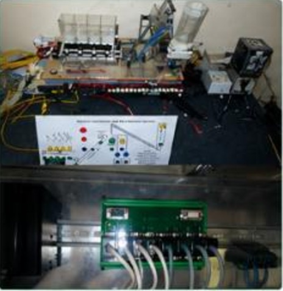 | 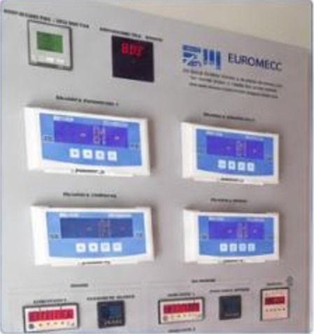 |
| **Hardware & system integration.** PLC, I/O modules and communication hardware, with neat wiring and reliable connections. | **HMI & operator interface.** Panels for monitoring and controlling operations, with real-time data and status indicators. |
| 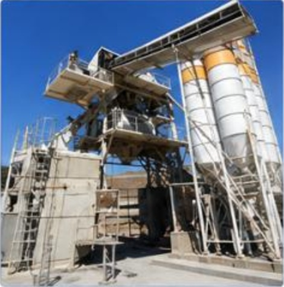 | 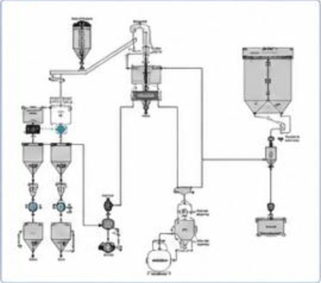 |
| **Concrete batching plant.** Plant automation covering material handling, weighing, mixing and discharge control. | **Process control diagram.** Process flow for batching: aggregate → weigh → mix → discharge. |
| 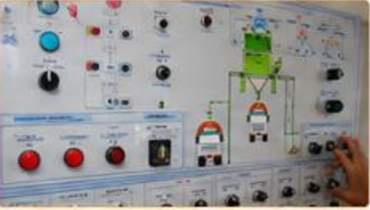 | 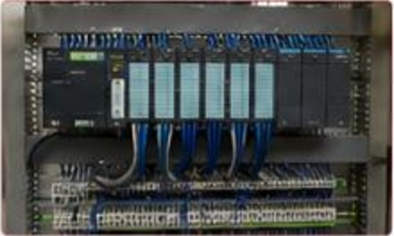 |
| **Control panel & components.** Push buttons, switches and indicators, with manual and automatic modes and safety controls. | **PLC I/O & modules.** PLC with digital and analog I/O modules for data acquisition and output control. |
| 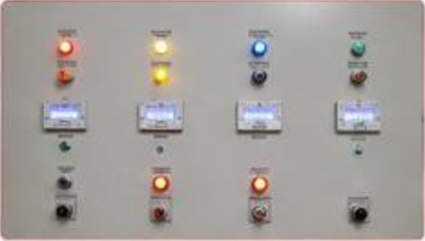 | 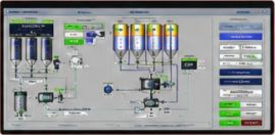 |
| **Monitoring & alarm system.** Alarms for faults and critical conditions, with real-time alerts. | **SCADA / monitoring interface.** Centralised monitoring with live data, trends, reports and historical logs. |

## 1. Control system architecture

The system is organised in four levels. Field sensors and actuators are wired to the PLC's I/O modules in the control panel. The PLC runs the sequences, interlocks and timing. HMI panels give operators set-points, recipes and manual or automatic modes, and SCADA supervises the whole process with alarms, trends and historical records. The PLC coordinates process logic and interlocks independently of the supervisory display. These explanatory diagrams do not establish a safety-rated architecture or verified behavior for every network fault.

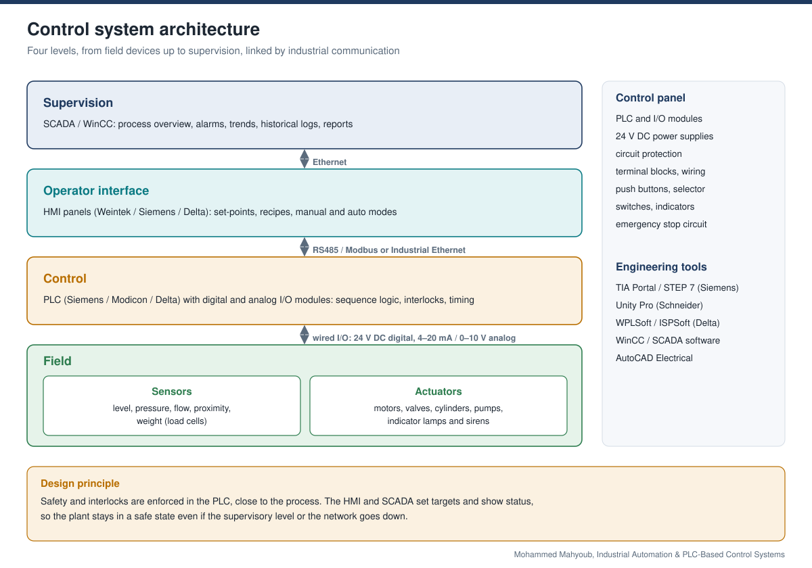

## 2. I/O structure and field wiring

Every field device reaches the PLC through a matching I/O module: buttons, switches and motor feedback on digital inputs; level, moisture and pressure on 4–20 mA analog inputs; motors, valves and cylinders on digital outputs through contactors and relays; drive speed on analog outputs. Field wires land on numbered terminals, and the I/O list ties every tag to its terminal and channel.

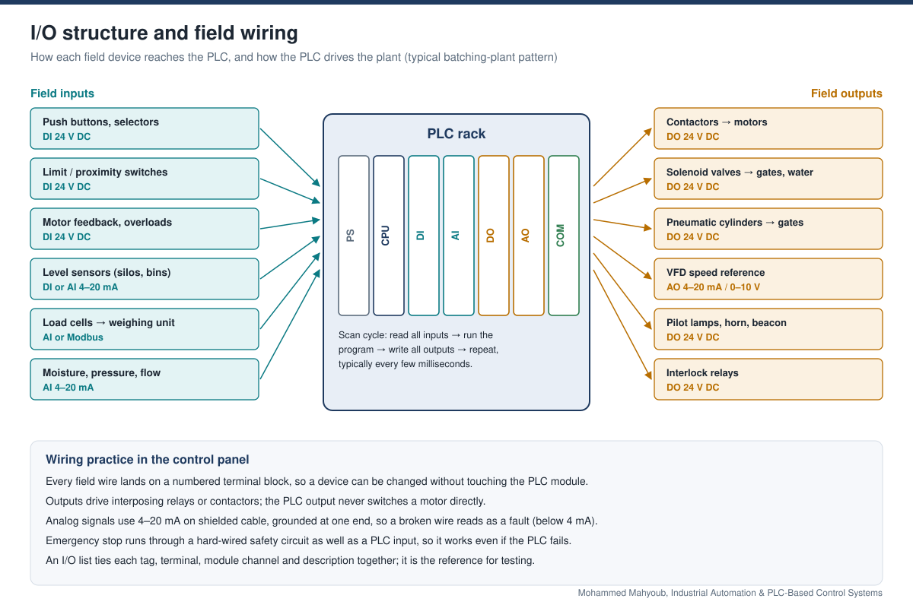

## 3. Concrete batching sequence

Each batch follows the same automated sequence: the operator selects a recipe, the PLC doses aggregates, cement, water and admixture, the load cells check every material against its target, the mixer runs for the set time, and the discharge gate empties the mixer into the truck. The PLC checks conditions before every step and stops the sequence with an alarm on any fault.

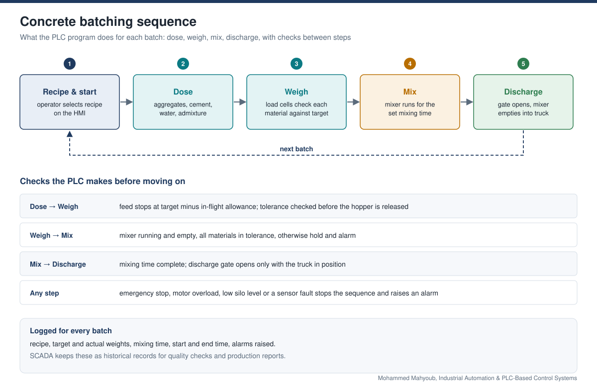

## 4. Weighing control

Accuracy comes from feeding each material in two speeds. Coarse feed fills quickly to most of the target; fine feed adds the rest slowly. The material still in the air when the gate closes is compensated by closing early, and the weight must settle inside the tolerance band before the hopper is released.

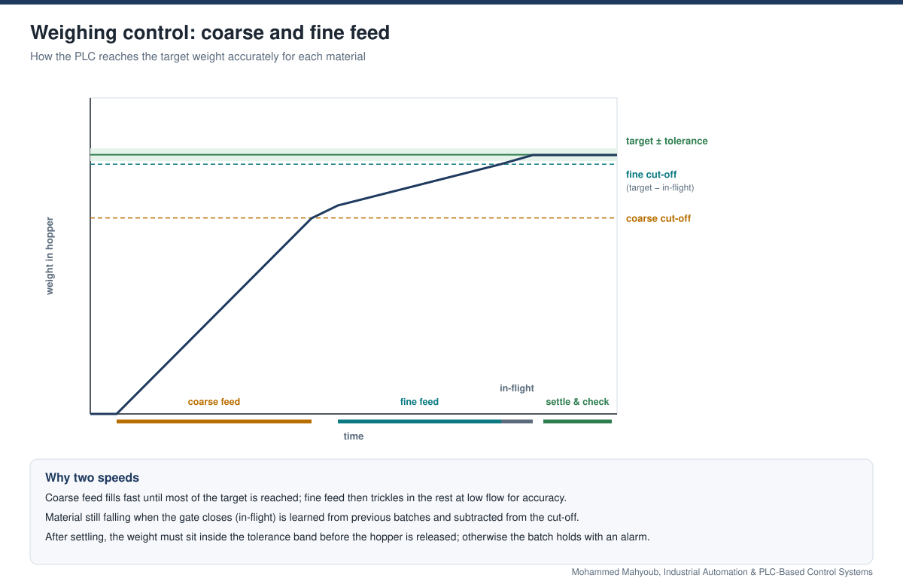

## 5. PLC logic example

Every motor in the plant uses the same ladder pattern: a start/stop circuit with a seal-in contact, normally-closed stop and overload contacts so a broken wire stops the motor, process interlocks, and a feedback check that raises an alarm if the motor does not actually start.

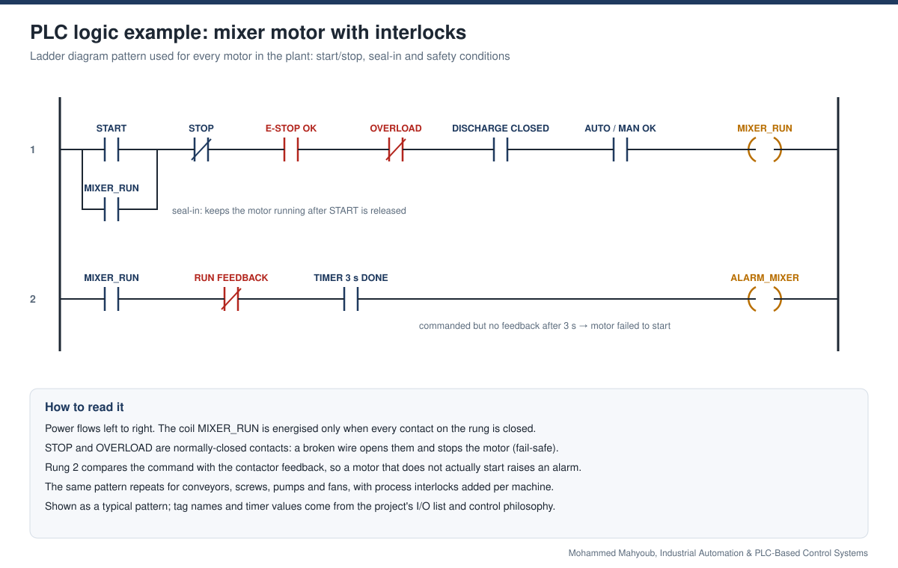

## 6. Industrial communication network

Supervision runs on Ethernet between the PLC, HMI and SCADA. Field instruments such as weighing indicators, drives and power meters share an RS485 bus where the PLC acts as Modbus master and polls each device by its address.

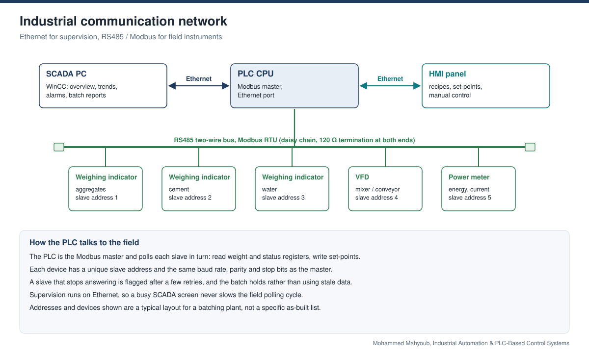

## 7. Alarm management

Alarms move through clear states (active, acknowledged, cleared) and carry a priority: high alarms stop the plant, medium alarms hold the batch, low alarms inform. Every alarm is time-stamped and logged, so the history explains each stop.

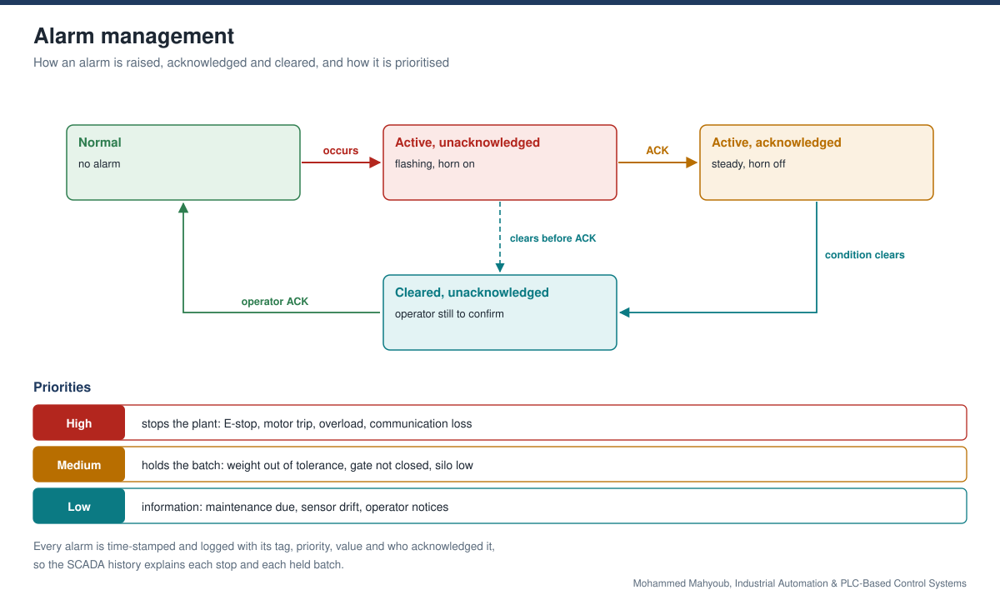

## 8. Project workflow

1. Process requirements analysis
2. System design and architecture
3. PLC programming and logic development
4. HMI design and interface configuration
5. Panel wiring and hardware integration
6. Testing, commissioning and validation
7. Monitoring and performance optimisation

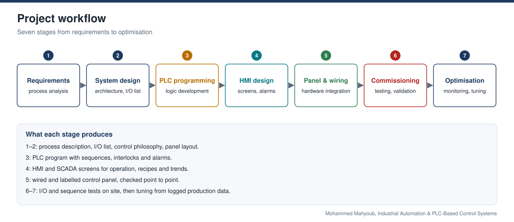

## 9. Testing and commissioning

Each stage proves one layer before the next is added: the panel itself, every I/O point, each analog loop end to end, the safety interlocks, the full sequence, and finally trial batches and operator handover.

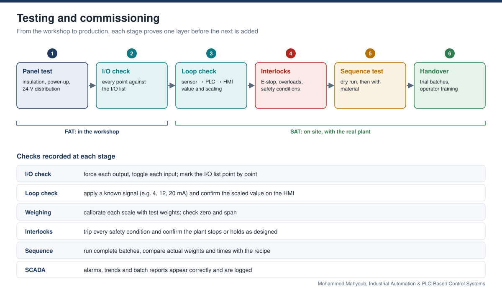

## System components

| Component | Role |
|---|---|
| PLC | Central processing unit for the control logic |
| HMI | Human-machine interface for operation |
| I/O modules | Digital and analog input/output |
| Sensors | Level, pressure, flow, weight |
| Actuators | Motors, valves, cylinders, pumps |
| Communication | RS485 / Modbus / Industrial Ethernet |
| Power supply | 24 V DC power supply units |
| Control panel | Panel assembly and wiring integration |

## Applications

Concrete batching plants, material handling systems, industrial process automation, water and wastewater systems, manufacturing and production lines, chemical and cement industries, power and energy plants, factory and infrastructure automation.

## Design goals

- Better process efficiency and accuracy, with less manual operation and fewer errors
- Real-time monitoring and control
- Reliable, stable operation with alarm and safety management
- A scalable design that is easy to extend
- Lower maintenance and operating cost
- Data logging for performance analysis

## Technologies

PLC (Siemens, Modicon, Delta), HMI (Weintek, Siemens, Delta), SCADA, WinCC, TIA Portal / STEP 7, Unity Pro, WPLSoft / ISPSoft, AutoCAD Electrical, RS485, Modbus RTU, Industrial Ethernet, load cells, ladder logic, motor control, alarm management, control panel design

## Note on the figures

The gallery photos come from the project poster. Diagrams 04–09 show the engineering patterns used in this kind of plant (I/O, weighing, ladder logic, network, alarms, commissioning); tag names, addresses and values in them are typical examples, not an as-built list.

## Related

- [Embedded Systems & IoT — PIC Firmware and Peripheral Integration](https://github.com/Mahyoub88/embedded-iot-automation)
- [Embedded EEPROM Data Storage & Retrieval System](https://github.com/Mahyoub88/eeprom-data-storage-pic)
- [All projects](https://mahyoub88.github.io/#work)
